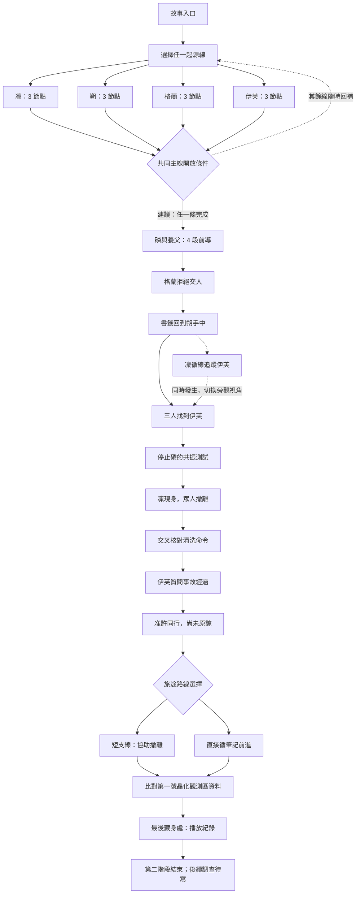
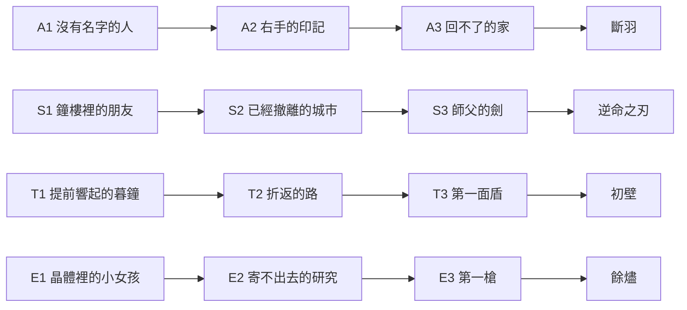
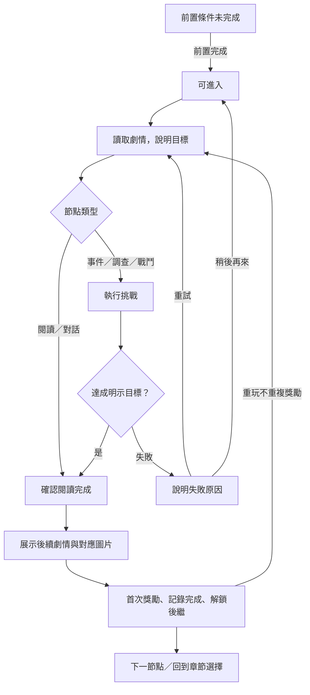
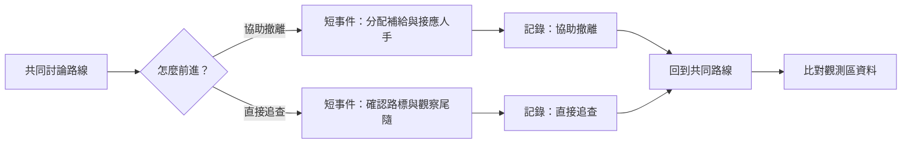

# Nightfall Duel｜進程遊戲樹 v0.1（歷史討論稿）
> 2026-09-23 更新：使用者已確認混合玩法、師父雙方存活 50 回合平手通關、博士／追兵戰勝後接劇情。最新因果檢視、28 節點配置與開發順序以 [開發規劃](story-development-plan.md) 為準。本稿下方的未定玩法與舊製作順序保留作歷史討論，不作現行規格。

狀態：討論稿，沒有修改遊戲規則或存檔。目的先釐清「到哪裡、做什麼、為何解鎖下一點」，再決定製作。現行四職業 12 節點已實作；下方前導、會合、共同章節與分支均為提案。

呈現使用 [Mermaid](https://github.com/mermaid-js/mermaid)（MIT 授權）：圖以 Markdown 純文字保存，不安裝套件、不使用付費服務、不新增生成圖片。可在支援 Mermaid 的 Markdown 閱讀器顯示，或複製圖表區塊至 Mermaid 編輯器。這份文件不會自動上傳至外部服務。

## 1. 整體進程

建議先採固定故事骨架，玩法選擇只產生短分支，再合流。起源篇是不同年代的回憶，不代表四人同時出發，也不代表玩家只能選其中一條。

箭頭代表遊玩／敘事先後；虛線代表可回補或同時發生，不是強制完成條件。圖中的觀測區節點是「整理證據」，不是已經抵達觀測區探險。

**尚待確認的開放條件：**現有頁面提示「四線完成後銜接」。本稿建議改為任一線完成即可進共同主線，其餘線供補完與收藏；若要維持四線全通，僅改 G 的 AND 條件，其後故事順序不變。目前不修改實際遊戲。

## 2. 四職業起源線與獎勵

| 節點 | 玩家目標／提案玩法 | 不可改寫的故事結果 |
|---|---|---|
| A1 | 潛入與觀察：找出入口、出口和目標 | 凜受命接近赫爾曼，尚不知道全部真相 |
| A2 | 脫離事故：選擇維修通道撤離 | 赫爾曼死於回流反噬，不是被凜刀殺 |
| A3 | 潛行避開伏擊：帶走有限線索 | 尺烏覆滅，凜沒有救回首腦的分支 |
| S1 | 探索／對話：交付書籤 | 建立朔與鳴者的關係，無需硬塞戰鬥 |
| S2 | 調查：比較座標與居民紀錄 | 證明撤離說法有問題，還不能證明暮晶來源 |
| S3 | 拖延型挑戰：撐到朋友離開 | 通關目標是保護出口，不是擊敗或殺死師父 |
| T1 | 疏散事件：選擇集合點與高地路線 | 鐘聲提前，原集合點失效 |
| T2 | 護送事件：安排母女與隊員接應 | 進入狹窄通道，母親跌倒 |
| T3 | 生存／護送挑戰：爭取接應時間 | 母女生還，第一面盾崩裂，夜域未消失 |
| E1 | 調查：更換設備、比對樣本 | 得到需要驗證的殘響，非完整歷史錄影 |
| E2 | 搜索／撤離：取回地下副本 | 取得研究與部分讀值，仍不知道完整死因 |
| E3 | 目標事件：破鎖並帶資料逃離 | 開出第一槍，不需要消滅所有追兵 |

現有每線前兩節點保留收藏條目與「Skin 待製作」狀態；第三節點解鎖四張已完成的正式 Skin。共同主線本輪建議以「解鎖下一段、圖鑑與證據條目」作獎勵，不預先承諾新增 Skin。這是分階段製作安排，原先每節點 Skin 的長期需求仍留在待辦。

## 3. 前導、會合與共同主線

| ID | 故事點 | 玩家在這裡做什麼（提案） | 可沿用圖片 ID |
|---|---|---|---|
| P1 | 災區抱起磷 | 短篇回憶閱讀，建立收養關係 | phosphor-found |
| P2 | 逃亡與陌生記憶 | 觀察異常，了解父親的隱瞞 | phosphor-memory |
| P3 | 文件接上，聯絡暴露 | 比較文件來源與跟蹤跡象 | phosphor-files |
| P4 | 父女分離 | 整理父親交付的書籤、文件與聯絡筆記 | phosphor-parting |
| B1 | 格蘭拒絕交人 | 詢問接收紀錄；拒絕後規劃改道 | tank-refusal |
| B2 | 書籤回到朔手中 | 憑書籤確認聯絡對象 | swordsman-return |
| B3 | 凜循線追蹤 | 短切換視角，交代她為何在附近；非另一條必刷線 | assassin-trail |
| C1 | 找到伊芙 | 遞交憑據，整理各人掌握的線索 | party-arrival |
| C2 | 停止共振測試 | 看見磷不適、停下測試，確立先找父親的目標 | gunner-stop |
| C3 | 凜現身救援 | 撤離／護送挑戰；有限時間內抵達出口 | party-rescue |
| C4 | 核對清洗命令 | 比對案號、日期與尺烏用語 | party-orders |
| C5 | 伊芙質問 | 整理目擊、讀值與記憶的異同，不作無證據定罪 | party-gun |
| C6 | 同意同行 | 確認資料與共振接觸的共同約定 | party-stay |
| C7 | 旅途分歧 | 選擇直接前進或短程協助撤離，稍後合流 | party-road |
| C8 | 觀測區資料 | 比對舊地名與採掘紀錄，標記仍未證實的身世疑問 | party-zone |
| C9 | 最後藏身處 | 角色協作搜索、點燈、接上紀錄器並聆聽 | party-recorder |

合計 **28 個邏輯故事節點**：起源 12＋前導 4＋會合 3＋共同主線 9。C7 額外有兩個路線結果，不算兩套長篇章節。現有 **29 張情境圖**皆可重用：E2 對應兩張圖片，其他邏輯節點各一張。邏輯故事節點不等於必須做 28 場戰鬥，也不等於畫面中每一個狀態都要生成一張圖。

## 4. 每個節點的進程回路

- 現行原型：各挑戰從進度 0、危險 0、補給 2 開始；危險 6 優先判失敗，進度 6 且未失敗即完成。
- 上述數值只屬現行事件原型，不直接套用卡牌戰鬥的 HP、護盾或回合。
- 提案：失敗回到當前節點起點，不刪除永久收藏或前面章節；開局前先明示完成與失敗條件。
- 提案：閱讀節點確認後完成，不要求毫無意義地點同一挑戰；調查提示不扣永久資源。
- 提案：檢查點放在節點邊界；不先製作戰鬥中途存檔。裝備設定與故事進度仍分開保存。
- 生存／護送型勝利不是目前決鬥引擎已具備的功能；若選擇混合玩法，先只在 C3 做一個適配案例再擴充。

## 5. 用小分支產生選擇感

本輪建議僅製作 **C7 一個二選一分支**。選擇影響一段事件、當前節點內的資源分配與之後一句回應；完成後合流，不新增永久貨幣、好感度量表或互斥結局。兩線都能繼續查找父親，不以交出磷換安全，也不因一次選擇永遠失去主線證據。

需要後續測試選擇是否有實質差異；本稿不把尚未設計的數值差異當成已平衡玩法。

## 6. 進度、證據與劇透是三件不同的事

| 資料 | 用途 | 不該造成的效果 |
|---|---|---|
| 玩家完成的章節 | 解鎖重玩、收藏、後繼節點 | 不讓角色自動知道其他職業的回憶 |
| 劇中共同取得的證據 | 在 C4、C8 等節點形成當下可說出的結論 | 不把單一殘響當成確定答案 |
| 圖鑑手動開啟後續劇情 | 供玩家看美術與設定 | 不自動通關、不給 Skin、不提前增加劇中證據 |

C4 只能確認清洗命令先於任務，不能指認最終簽發者。C5–C6 仍需查證死因與責任，同行不等於原諒。C8 不確認嬰兒身分。C9 不確認父親生死或幕後安排者。世界地圖是概念稿，本輪不用它推算旅行天數或精確戰略距離。

## 7. 最小製作順序與待確認事項

1. 先確認此遊戲樹與主線開放條件。
2. 確認挑戰方向：混合玩法／全卡牌／暫不決定。混合方向最符合原稿，但不是已確認結論。
3. 僅把 C1–C3 做成一段可玩流程，驗證閱讀、事件、挑戰、獎勵與存檔能接起來。
4. 再補 C4–C9，最後加 C7 短分支；前導與會合以既有圖文為主。
5. 之後才討論新增 Skin、長期成長與更多分支。

釐清階段只維護此 Markdown 文件，沒有新增圖片、套件、服務或遊戲引擎。驗收重點：前置關係無死路；每點目標清楚；所有失敗可重試；重玩不重複發獎；兩分支可合流；角色知識不跨越劇情；29 張既有圖片均有去向。
