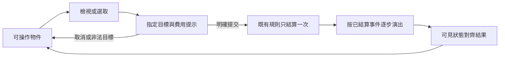

# RESEARCH-008｜卡牌手感與敘事進程：產品研究與交接

日期：2026-09-24。狀態：**研究與分派完成，產品驗收通過**；候選尚未實作，五角色均已完成參考接收。研究範圍：Hearthstone、Magic: The Gathering Arena（紙牌規則的數位互動案例）、其他數位卡牌的可讀性，以及 Detroit: Become Human。使用者要求找到洞見並分派 agent 參考；這份文件是研究後的產品取捨，**不是直接套用原作機制、素材或整套介面的實作工單**。

## 核心判斷

Nightfall 下一階段的精緻度，應優先來自**可理解的操作、連續的物件、可信的動作因果，以及有記憶的故事**。增加紋樣、粒子或分支數量，不能補救目標不明、數值提早跳動、選項與台詞不一致的問題。這是產品綜合推論，需以自家測試驗證效果。

一個特別有力的原始案例：爐石設計師 Peter Whalen 說明，卡拉贊棋盤最初沿用撞擊動畫，讓玩家以為攻擊者會承受反傷，因此改變演出來表達該關卡的實際規則。**動作會教玩家規則**，所以 Nightfall 的劍客斬擊、刺客近身、坦克重擊與槍手射擊必須各有可辨語意，不能任意共用彈道。這是從案例推導出的本專案原則。[Blizzard 開發文章，2016-10-07](https://hearthstone.blizzard.com/en-us/news/20271423)

## 研究方法與限制

- 優先已開讀的官方功能說明、開發者訪談／演講資料、原作者技術說明；事實、推論、自訂參數分開。每份分報告記載來源、日期、可支持的主張。
- GDC 場次摘要只用於確認演講範圍與製作者身份，不當作看過完整演講或量測原作。沒有親自完成各款遊戲全流程或逐幀測量，不能宣稱逆向取得其物理引擎／彈簧參數／命中幀。
- 參考歷史設計的年份明列；不將 2016 棋盤關卡、2021 行動版或特定遊戲模式直接當成所有版本的一般規則。
- 本專案對照以目前原始碼、角色文件、[工程審查](../../engineering-workflow.md)、[素材預算](../../art-asset-budget.md)、[故事收尾](../story-completion-audit.md)與[故事戰鬥介面](../story-battle-ui-001.md)為依據。舊功能測試是現況證據，本輪沒有重新宣稱整套遊戲測試通過。

## 分報告

| 領域 | 閱讀文件 | 下一輪使用方式 |
| --- | --- | --- |
| 卡牌操作／UI | [互動研究](benchmark-interaction-ui.md) | 卡片檢視、選取、拖曳、指向、合法目標與取消的共用狀態規格 |
| 物理感／FX／音效 | [動作研究](benchmark-physical-feedback.md) | 物件身份、抬升／落定、阻尼、接觸事件及音畫同步 |
| 卡牌資訊／遊戲樹 | [資訊與狀態研究](benchmark-state-legibility.md) | 可行動者、費用、預覽限制、結算可讀性與規則隔離 |
| 對話／進程 | [Detroit研究](benchmark-narrative-progression.md) | 選項承諾、調查與證據、短分支記憶、回看與保存 |
| 工程把關 | [研究可行性審查](benchmark-engineering-review.md) | 來源可信度、資料契約、既有功能重複及可驗收邊界 |

## 六款遊戲，各取一個值得移植的原則

以下最後一欄是 Nightfall 的產品推論，不是競品內部實作或成效保證。完整證據與限制見分報告。

| 標竿 | 原始資料中的設計線索 | Nightfall 應借鏡的原則 |
| --- | --- | --- |
| Hearthstone | 動畫輪廓會影響玩家對反傷規則的理解；聲音圍繞施放與命中節拍製作。[棋盤案例](https://hearthstone.blizzard.com/en-us/news/20271423)、[音效訪談](https://hearthstone.blizzard.com/en-us/news/23964694) | 劍、刃、盾、槍各有動作語意；接觸時才出現相應數值與聲音。 |
| MTG Arena | 有些自動支付會先展示方案，讓玩家核對；自動優先權亦有例外。[支付設計](https://magic.wizards.com/en/news/mtg-arena/mtg-arena-state-game-the-brothers-war)、[Smart Priority](https://magic.wizards.com/en/news/mtg-arena/announcements-october-27-2025) | 操作前看懂成本，操作後知道何時恢復控制；明確說明不能行動的原因。 |
| Legends of Runeterra | Oracle’s Eye 在能預測時展示待結算序列的結果。[官方說明](https://support.riotgames.com/en-us/legends-of-runeterra/gameplay/oracle-s-eye) | 預覽區分確定、條件、隨機、未知；對手暗牌與未擲結果不進預覽。 |
| Slay the Spire | Intent 從逐隻查看詳細文字，改成可同時掃視的圖示與數字。[Anthony 原始訪談](https://www.nintendo.com/jp/topics/article/1f6d2f1e-b7ea-11e9-b641-063b7ac45a6d) | 將已公開的狀態、行動額度、費用做成一致徽章；不因此公開尚未決定的 AI 行動。 |
| MARVEL SNAP | 原 UI 設計者以卡牌為主角，局部方向光傳達領先方。[設計者案例](https://www.tiffanysmart.com/work/marvel-snap) | 讓古金光澤指向目前來源與目標，降低周圍裝飾對比；沿用原畫，避免新增狀態大圖。 |
| Detroit: Become Human | 調查可解鎖對話，章節流程圖讓玩家回顧已走與未探索的路。[官方試玩](https://blog.playstation.com/archive/2018/04/23/7-things-youll-notice-in-your-first-30-minutes-of-detroit-become-human/)、[製作者訪談](https://blog.ja.playstation.com/2018/04/24/20180424-detroit/) | 選項、角色所知、立即回應及稍後回應形成因果鏈；先打磨 C7→C8，不追求空泛分支數量。 |

## 兩種遊戲流程需要不同的控制權

| 層次 | 自由決鬥 | 故事暮晶戰鬥 | 本次研究的設計約束 |
| --- | --- | --- | --- |
| 行動 | 既有出牌與自動回合 | 橫向戰場、角色普攻與常駐技能牌、結束回合 | 不把 MTG 的 stack／優先權、SNAP 的同時排程或抽牌制度移植過來 |
| 表現 | 既有不透明翻牌、職業攻擊、日夜場景 | 既有 frames 逐步演出與輸入鎖 | 改善可讀性與一致性；不要再造第二套規則求解器 |
| 資訊 | 隱藏的對手牌／尚未決定的機率結果 | 依本遊戲允許公開的能力與目標 | 不因預覽讀取AI未決定內容，不讓介面重擲隨機結果 |
| 取消 | 提交前回手；提交後遵守既有回合 | 提交前取消；演出中退出依既有契約 | 演出取消與撤回已提交行動是兩回事，不能偷偷回退規則狀態 |

## 共用互動模型（Nightfall提案）

這是分析用狀態圖，不是將故事 UI 現有 API 改名。拖曳、點選、鍵盤應走同一合法性與提交入口；閱讀卡牌不應等於使用卡牌。操作中的原畫、卡框、卡名、比例和抓取點保持連續，僅改姿態、陰影及提示。提交之後的跳過／減少動態／退出，只改呈現與清理方式，結果一致。

## 產品建議順序與驗收候選

下列都是研究後候選；先查現行是否已滿足，只為確認的缺口建立實作工單，不重做已有成果。

| 順序／候選 | 交付角色 | 下一份可審查成果 | 驗收方式與邊界 |
| --- | --- | --- | --- |
| 1．操作狀態一致 | 美術UI＋遊戲樹 | 卡片／角色的檢視、選取、合法／非法目標、已用、播放鎖定狀態表 | 鼠／觸控／鍵盤提交相同命令；無效放置不消耗資源；材質與抓點不跳變 |
| 1．接觸與數值一致 | FX音效＋工程師 | 每種職業的起手、軌跡、接觸、回復與聲音觸發表 | 無命中前扣血浮字；閃躲不播命中；護盾／HP按真實事件；音訊須另做聽測 |
| 1．資料與呈現隔離 | 遊戲樹＋工程師 | 沿用既有frames／事件的欄位責任與可見資訊表 | 同樣輸入在正常／減少動態／中斷取得同樣狀態及RNG次數；預覽無副作用 |
| 2．看得懂不能做的原因 | 美術UI＋遊戲樹 | 費用、額度、目標與狀態的局部提示樣稿 | 不只把牌變灰；原因簡短具體，讀卡與說明仍可用，不洩漏隱藏情報 |
| 2．有記憶的對話 | 劇情＋遊戲樹 | C7→C8與一個調查接點的意圖／知識／後果表 | 選項與實際台詞一致；記錄／回看／保存一致；不擅改正史與四戰目標 |
| 3．收斂的物理細節 | FX＋美術UI | 一組既有牌的姿態／陰影／回位對照原型 | 輸入平移準確、回彈衰減、桌面高度不穿透；30／60／120Hz結果一致性為候選目標，需實測 |
| 3．非劇透旅程回顧 | 劇情＋美術UI | 只畫真實既有分支的章末／章節圖草案 | 不把線性步驟偽裝成分支；未知內容不外洩，仍可直接繼續故事 |

## 團隊交接與完成證據

候選項的「已接收」只表示研究交接完成，不代表遊戲功能已實作。角色文件會保留研究入口，後續按工單喚起，使用者不需到別處重述需求。

| 角色 | 本輪交接與責任 | 接收狀態 |
| --- | --- | --- |
| 美術／UI | 操作狀態表、讀卡與出牌分離、目標／禁用原因、卡面連續性 | 已交付並完成多指契約補正；參考已接收，未實作 |
| 特效／音效 | 準確抓點、姿態阻尼、接觸音畫同步、職業輪廓 | 已交付 FX 分報告；參考已接收，未實作 |
| 遊戲樹 | 可見資訊契約、合法性、預覽純讀取、事件順序 | 已交付遊戲樹分報告；參考已接收，未實作 |
| 劇情 | C7→C8 意圖／知識／後果表、回看／保存、真實分支回顧 | 既有劇情角色已完成唯讀接收：先做 C7→C8 意圖／記錄表、調查證據表及回看／收錄界線；與四戰／S3 無衝突，未實作 |
| 工程師 | 來源與推論、模型可行性、RNG／API／保存邊界 | 來源與模型審查、抓點補正複審通過；參考已接收，未實作 |

交付範圍為六份研究／審查 MD、角色文件中的研究入口與工作板本工單區段。沒有生成圖片／音檔、下載遊戲素材或修改執行碼；因此未跑遊戲回歸，也沒有更新 JS／CSS 資源版本。本輪未做競品實機逐幀量測、Nightfall 玩家理解度測試或新模型原型；自訂物理參數與候選效益需要後續實測。

產品驗收：四份領域研究及工程審查已完成；已核對主要原始來源、現有功能與候選邊界。初審指出的抓點逆映射前提已補正，UI 多指敘述與候選順位已校準；工程師結論為可交付研究。五角色文件均有持續參考入口，五角色的已讀與相容回覆已記錄，與候選採用／實作狀態分開。文件本機連結與交接入口檢查通過。

劇情後續回覆已收到：C7 兩線皆延續尋父，不把 direct 寫成棄救；證據區分看見／收取／核對／可引用／仍不能證明；回看保持只讀。另記既有舊檔缺 flag 的預設行為需後續釐清，本研究不改存檔或台詞。
